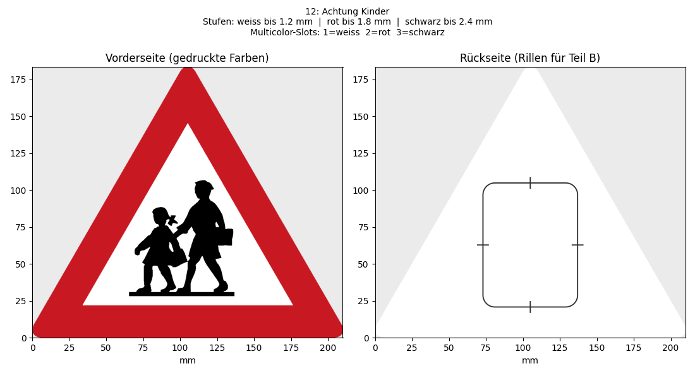

# Verkehrszeichen 3D – Österreich

Erzeugt aus den offiziellen SVG-Grafiken der österreichischen Verkehrszeichen druckfertige 3D-Modelle, und zwar in zwei Varianten je Zeichen:

- **Stufen-Modell (`.stl`)** für Drucker mit einem Extruder. Jede Farbe ist eine eigene Höhenstufe, du wechselst das Filament per Pause (z. B. Ender 3).
- **Multicolor-Modell (`.3mf`)** für Mehrfarbdrucker (Bambu Studio / OrcaSlicer mit AMS). Alle Farben liegen bündig in einer Ebene und sind beim Öffnen schon den Filament-Slots zugeordnet.

Dazu gibt es einen **Schildhalter** (`schildhalter.py`): eine Stangenkappe für 10-mm-Rundholz und eine Klebeplatte für die Schildrückseite, die per Schwalbenschwanz zusammengesteckt werden. Auf der Rückseite jedes Schilds ist eine Rille eingearbeitet, die zeigt, wo die Klebeplatte hinkommt.



Die Grafiken stammen von der Wikipedia-Seite [Bildtafel der Verkehrszeichen in Österreich](https://de.wikipedia.org/wiki/Bildtafel_der_Verkehrszeichen_in_%C3%96sterreich) und von Wikimedia Commons. Österreichische Verkehrszeichen sind amtliche Werke und damit gemeinfrei.

---

## Installation

Du brauchst Python 3.10 oder neuer (getestet mit 3.13).

```bash
pip install numpy opencv-python-headless resvg-py trimesh manifold3d matplotlib
```

Beim ersten Lauf lädt das Skript die Zeichenliste und die SVGs herunter und legt sie in `cache/` ab. Danach funktioniert alles offline.

---

## Verwendung

### `verkehrszeichen.py`: Schilder erzeugen

```bash
python verkehrszeichen.py --liste                    # alle Zeichen mit Nummer anzeigen
python verkehrszeichen.py --liste --suche kinder     # Liste filtern
python verkehrszeichen.py 35                         # Zeichen Nr. 35 erzeugen
python verkehrszeichen.py 17 42 43                   # mehrere Zeichen
python verkehrszeichen.py "Vorschriftszeichen_24"    # per Wikimedia-Dateiname oder eindeutigem Textteil
python verkehrszeichen.py --alle                     # alle Zeichen (bereits erzeugte werden übersprungen)
python verkehrszeichen.py --alle --suche Gefahr      # nur die passenden
python verkehrszeichen.py 35 --modell multicolor --groesse 150
```

Wenn du das Skript ohne Argumente startest, zeigt es die Liste an.

| Parameter | Standard | Bedeutung |
|---|---|---|
| `zeichen …` | – | Nummer aus `--liste`, Wikimedia-Dateiname oder eindeutiger Textteil. Bei mehreren Treffern zeigt das Skript sie an und du wählst per Nummer. |
| `--liste` | – | Zeichen nach Abschnitt gruppiert auflisten |
| `--suche TEXT` | – | Filter für `--liste` und `--alle`; durchsucht Beschreibung, Dateiname und Abschnitt |
| `--alle` | – | Alle (gefilterten) Zeichen nacheinander erzeugen. Fehler bei einzelnen Zeichen brechen den Lauf nicht ab. |
| `--neu` | – | Mit `--alle`: auch Zeichen neu erzeugen, deren Dateien schon existieren |
| `--neu-laden` | – | Zeichenliste neu von Wikipedia holen (`cache/katalog.json` verwerfen) |
| `--modell` | `beide` | `stufen`, `multicolor` oder `beide` |
| `--groesse MM` | `190` | Längere Seite des Schilds in mm |
| `--schicht MM` | `0.2` | Schichthöhe im Slicer. Alle Höhen werden auf Vielfache davon gerundet. |
| `--basis MM` | `1.2` | *Stufen:* Dicke der Grundplatte (hellste Farbe) |
| `--stufe MM` | `0.6` | *Stufen:* zusätzliche Höhe je weiterer Farbe |
| `--mc-dicke MM` | `3.0` | *Multicolor:* Gesamtdicke der Platte |
| `--mc-farbe MM` | `0.6` | *Multicolor:* Dicke der Farbschicht auf der Sichtseite |
| `--reihenfolge a,b,c` | hell → dunkel | Farbreihenfolge von unten nach oben selbst festlegen, z. B. `weiss,rot,schwarz`. Alle im Zeichen vorkommenden Farben müssen enthalten sein. |

Mögliche Farbnamen: `weiss`, `gelb`, `orange`, `grau`, `rot`, `gruen`, `blau`, `braun`, `schwarz`.

Einige Feineinstellungen gibt es nur als Konstanten oben im Skript, z. B. die Renderauflösung (`PX_MM`), die Mindestgröße von Farbinseln (`MIN_FLAECHE`) und die Rillenmaße (`RILLE_B`, `RILLE_T`).

#### Ergebnis

Für jedes Zeichen landen vier Dateien in `ausgabe/`, z. B. `035_Gefahr-12_Achtung-Kinder_…`:

| Datei | Inhalt |
|---|---|
| `…_Stufen.stl` | Druckdatei für einen Extruder, bereits richtig ausgerichtet (Rückseite unten) |
| `…_Multicolor.3mf` | Projektdatei für Bambu Studio / OrcaSlicer: Farben als Teile, Slots vorbelegt, Sichtseite unten |
| `…_anleitung.txt` | Schichtnummern für die Farbwechsel, Slot-Belegung, Position der Halterplatte, Filamentbedarf |
| `…_vorschau.png` | Vorder- und Rückseite |

Die führende Nummer ist die Nummer aus `--liste`.

**Farbwechsel beim Stufen-Modell (Cura):** Erweiterungen → Nachbearbeitung → Skript hinzufügen → *Filament Change* (oder *Pause at height*). Lege für jeden Farbwechsel einen Eintrag mit der Schichtnummer aus der `_anleitung.txt` an.

### `schildhalter.py`: Halterung erzeugen

```bash
python schildhalter.py
python schildhalter.py --text-a "STOP" --text-b-links "2026" --modus erhaben
```

Das Skript erzeugt `Teil_A_Stangenkappe.stl` und `Teil_B_Schildplatte.stl`, beide schon in Druckausrichtung.

| Parameter | Standard | Bedeutung |
|---|---|---|
| `--text-a TEXT` | `TEXT_A` im Skript | Beschriftung auf der Rückseite der Stangenkappe (`""` = keine) |
| `--text-b-links TEXT` | `TEXT_B_LINKS` im Skript | Beschriftung links neben der Nut der Klebeplatte |
| `--text-b-rechts TEXT` | `TEXT_B_RECHTS` im Skript | Beschriftung rechts neben der Nut |
| `--modus` | `gravur` | `gravur` (vertieft) oder `erhaben` |
| `--tiefe MM` | `0.8` | Gravurtiefe bzw. Höhe der erhabenen Schrift |
| `--schrift NAME` | `DejaVu Sans` | Schriftname oder Pfad zu einer `.ttf`/`.otf` |

Zu lange Texte werden automatisch verkleinert, unter 4 mm Buchstabenhöhe gibt es eine Warnung. Stabdurchmesser, Passungsspiel und alle anderen Maße stehen als Konstanten oben im Skript.

**Montage:**

1. Teil A oben auf den Rundstab kleben.
2. Teil B mit der offenen Nut nach unten in die Rille auf der Schildrückseite kleben.
3. Das Schild von oben auf die Schiene schieben. Es hält durch sein Gewicht, verdreht sich nicht und lässt sich wieder abziehen.

---

## Wie es funktioniert: von der SVG zur STL/3MF

Die Pipeline in `verkehrszeichen.py` arbeitet **rasterbasiert**. Die SVG wird nicht direkt als Vektorgrafik geometrisch verarbeitet, sondern zuerst als hochaufgelöstes Pixelbild gerendert. Dort werden die Farbflächen bereinigt und erst danach wieder in Polygone umgewandelt. Das ist robuster als direkte Vektorverarbeitung, weil die Wikimedia-SVGs sehr unterschiedlich aufgebaut sind (Transformationen, überlappende Formen, Text, Clipping, Strichbreiten).

### 1. Zeichenliste von Wikipedia

Das Skript holt über die MediaWiki-API (`action=parse`) das HTML der Bildtafel-Seite. Per regulärem Ausdruck liest es darin die Abschnittsüberschriften (`<h2>`/`<h3>`) und die Galerie-Einträge (`<li class="gallerybox">`). Pro Eintrag nimmt es mit:

- den SVG-Dateinamen,
- die Bildunterschrift,
- Breite und Höhe der Datei.

Alle Einträge bekommen eine fortlaufende Nummer und werden in `cache/katalog.json` gespeichert. Aus Kategorie (Präfix des Dateinamens), Zeichen-Code und Beschreibung entsteht ein sprechender, dateisystemtauglicher Name, z. B. `035_Gefahr-12_Achtung-Kinder`.

### 2. SVG herunterladen

Die Download-URL jeder SVG ermittelt das Skript über die Commons-API (`prop=imageinfo`) und legt die Datei in `cache/svg/` ab. Zwischen zwei Anfragen wartet es 1 s. Wenn Wikimedia trotzdem bremst (HTTP 429), wartet es gemäß `Retry-After` bzw. mit exponentiellem Backoff und versucht es erneut. Die Datei wird erst nach erfolgreichem Download geschrieben, damit keine leeren Cache-Dateien entstehen.

### 3. Rendern ohne Kantenglättung

[resvg](https://github.com/linebender/resvg) rendert die SVG mit `shape_rendering="crisp_edges"`. Die längere Seite wird dabei `GROESSE × PX_MM` Pixel lang, standardmäßig 190 mm × 20 px/mm = 3800 px. Ein Pixel entspricht also 0,05 mm.

Die Kantenglättung ist bewusst ausgeschaltet: Sonst entstehen an jeder Kante Mischfarben (z. B. Rosa zwischen Rot und Weiß), die keiner Druckfarbe zugeordnet werden können. Einheiten wie `mm` im `<svg>`-Kopf entfernt das Skript vorher, weil resvg-py sie nicht versteht.

### 4. Umriss bestimmen

Alle Pixel mit Alpha ≥ 128 gelten als Teil des Schilds. Davon zeichnet das Skript nur die Außenkontur gefüllt nach, sodass transparente Löcher *innerhalb* des Schilds zum Schild gehören. Dann folgen zwei Aufräumschritte:

- Eine morphologische Öffnung mit 0,6 mm Kerndurchmesser entfernt dünne Anhängsel.
- Von den zusammenhängenden Teilen bleiben nur die, die mindestens 5 % der Fläche des größten haben.

### 5. Farben zuordnen

Jede im Bild vorkommende Farbe (wegen des harten Renderns sind es nur wenige) wird über Farbton, Sättigung und Helligkeit (HSV) einer von neun Druckfarben zugeordnet:

- sehr dunkel → schwarz
- wenig gesättigt → weiß, grau oder schwarz, je nach Helligkeit
- sonst nach Farbton: rot, orange/braun, gelb, grün oder blau

Ergebnis ist ein Label-Bild, das für jedes Pixel den Index seiner Druckfarbe enthält. Transparente Stellen innerhalb des Umrisses bekommen später die unterste Farbe.

### 6. Farbflächen bereinigen

Drei Filter machen das Bild druckbar. Wenn Pixel entfernt werden, bekommen sie jeweils die Farbe des nächstgelegenen verbleibenden Pixels (Distanztransformation mit Pixel-Labels).

1. **Haarlinien** (`HAARLINIE` = 0,25 mm): Das Skript öffnet jede Farbe morphologisch. Was dabei verschwindet, ist schmaler als 0,25 mm und wird neu zugeordnet. Das betrifft vor allem Lücken zwischen aneinanderstoßenden SVG-Formen, durch die der Hintergrund durchblitzt. Solche Stellen sind ohnehin nicht druckbar und würden sonst getrennte Flächen verbinden.
2. **Randlinien** (`RANDLINIE` = 2 mm): Wikipedia zeichnet manche Schilder mit einer dünnen dunklen Kontur, damit sie sich vom Seitenhintergrund abheben. Farbige Komponenten (außer Weiß), die den Rand berühren und komplett in einem 2-mm-Streifen am Rand liegen, werden entfernt. Das spart einen Farbwechsel.
3. **Kleine Inseln** (`MIN_FLAECHE` = 0,5 mm²): Kleinere zusammenhängende Farbflecken übernehmen die häufigste Farbe ihrer Nachbarpixel. Das Skript macht zwei Durchgänge, weil sich durch das Umfärben neue kleine Inseln bilden können.

### 7. Farbreihenfolge

Die Farben werden nach Luminanz sortiert, von hell nach dunkel. Du kannst die Reihenfolge auch mit `--reihenfolge` vorgeben. Die hellste Farbe wird die Grundfarbe. Beim Stufen-Modell liegen dunkle Farben dadurch immer auf helleren, decken sauber ab und nichts scheint durch.

### 8. Vektorisieren

Für jede Farbe (und für den Umriss) werden aus der Binärmaske Konturen extrahiert (`cv2.findContours`) und mit Douglas-Peucker vereinfacht (`KANTE_GLATT` = 0,04 mm Toleranz). Anschließend rechnet das Skript sie von Pixel- in mm-Koordinaten um (Pixelmitte, y-Achse nach oben gedreht). Sie werden zu einer 2D-`CrossSection` von [manifold3d](https://github.com/elalish/manifold) mit Even-Odd-Füllregel, damit Löcher erhalten bleiben. Alle weiteren Schritte sind robuste boolesche Operationen in 2D und 3D.

### 9. Rillen für die Halterplatte

Die Position der Halterplatte ist der Flächenschwerpunkt des Umrisses (aus den Bildmomenten). So hängen auch Dreiecke gerade. Die Rille besteht aus zwei Teilen:

- einem 0,8 mm breiten Ring, der genau dem abgerundeten Rechteck von Teil B entspricht (Maße aus `schildhalter.py`),
- vier 8 mm langen Mittenmarken, die zu den V-Kerben von Teil B passen.

Die Rille wird mit dem Umriss geschnitten und 0,4 mm tief in die Rückseite eingelassen. Ist das Schild niedriger als die Platte (z. B. Einbahnstraße), sitzt die Platte oben bündig und ragt unten über. Das Skript prüft außerdem, ob ringsum 2 mm Rand bleiben, und warnt, wenn nicht.

### 10a. Stufen-Modell

- Der Umriss wird auf `basis` extrudiert (Grundfarbe).
- Jede weitere Farbe *i* wird von z = 0 bis `basis + i × stufe` extrudiert und mit dem Körper vereinigt. Damit das funktioniert, vergrößert das Skript die Fläche jeder Farbe vorher um 0,1 mm und schneidet sie mit dem Umriss. So fallen Kanten am Schildrand exakt auf den Umriss und es entstehen keine hauchdünnen Splitter.
- Die Rillen werden abgezogen.
- Alle Höhen sind auf Vielfache der Schichthöhe gerundet. Aus der Höhe jeder Stufe ergibt sich direkt die Schichtnummer für den Farbwechsel (`z / Schicht + 1`), die in der Anleitung steht.

### 10b. Multicolor-Modell

- **Die Farbflächen werden überschneidungsfrei aufgeteilt:** Jede Farbe bekommt ihre Fläche abzüglich der schon vergebenen, und die Grundfarbe bekommt den Rest des Umrisses. Dadurch füllt sie auch Haarspalte zwischen den einzeln vereinfachten Konturen. Eine Öffnung um ±0,02 mm (`MC_SPLITTER`) entfernt Reste der Subtraktionen, die sonst nicht-dichte Teile ergeben würden.
- **Jede Farbe wird zu einem eigenen Körper:** Sie wird als `mc-farbe` dicke Schicht an der Vorderseite extrudiert. Die Grundfarbe bekommt zusätzlich den Plattenkörper dahinter (`mc-dicke − mc-farbe`), von dem die Rillen abgezogen werden.
- **Alle Teile werden um 180° um die y-Achse gedreht** (nicht gespiegelt!). Die Sichtseite liegt dann lesbar auf dem Druckbett und bekommt dessen Oberfläche, also glatt oder strukturiert.

### 11. Mesh aufbereiten

Das Manifold-Mesh wird in ein [trimesh](https://trimesh.org/) umgewandelt:

1. Die Koordinaten werden auf `float32` gerundet, also die Genauigkeit von STL. So fallen Punkte, die erst beim Export zusammenfallen würden, schon jetzt zusammen und werden verschmolzen.
2. Entartete Dreiecke und unbenutzte Punkte werden entfernt, ebenso abgespaltene Splitter mit weniger als 0,01 mm³ Volumen.
3. Das Skript gibt aus, ob jedes Ergebnis wasserdicht ist.

### 12. Export

- **STL:** direkt über trimesh, mittig um den Ursprung.
- **3MF:** Die Datei wird von Hand im Projektformat von Bambu Studio / OrcaSlicer geschrieben, als ZIP mit folgendem Inhalt:
  - `3D/Objects/object_1.model` enthält je Farbe ein Mesh-Objekt.
  - `3D/3dmodel.model` fasst diese als Komponenten eines Objekts zusammen und platziert es in der Bettmitte (128/128 mm).
  - `Metadata/model_settings.config` ordnet Teil *i* dem Extruder bzw. Filament-Slot *i* zu und benennt jedes Teil nach seiner Farbe.
  - Die Kennung `Application = BambuStudio-02.00.00.00` sorgt dafür, dass beide Slicer die Datei als Projekt mit Teilen und Slot-Zuordnung öffnen und nicht als einfaches Mesh.

### 13. Anleitung und Vorschau

Zum Schluss schreibt das Skript die `_anleitung.txt` mit Schichtnummern, Slots, Plattenposition, Flächen je Farbe und Filamentbedarf (Volumen × 1,24 g/cm³ für PLA). Außerdem rendert es mit matplotlib die `_vorschau.png` mit Vorderseite und gespiegelter Rückseite samt Rillen.
